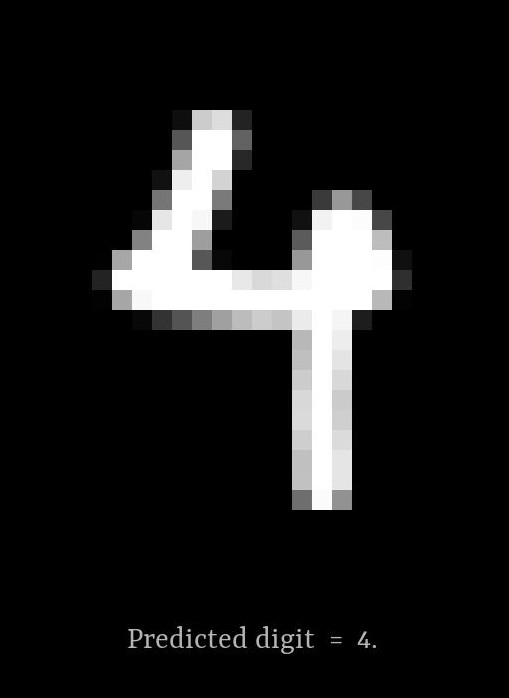

# Digit-Recognizer

> A neural-network based handwritten digit recognition system.

### About

Digit-Recognizer is a simple handwritten digit recognition system which employs an artificial neural network to classify a <b>28 X 28</b> image into one of the ten decimal digits.
The recognition system uses the <b>[MNIST dataset](http://yann.lecun.com/exdb/mnist/)</b> of handwritten digits for training the neural network, which consists of a training set of <b>60,000</b> images and a test set of <b>10,000</b> images.

The artificial neural network is coded from scratch in python and uses the Adam algorithm with mini-batches for optimization. Besides that, the system also makes use of python's [Numpy](https://www.numpy.org/) package to optimize its matrix operations.
The currently trained neural network shows upto <b>97.4%</b> accuracy of prediction on the test set. The GUI for the project is made using the [pygame](https://www.pygame.org/) library.

Further improvements to the project :
- Batch Normalization
- Drop-out Regularization

### Usage
First, install the required libraries.

    pip3 install -r requirements.txt
    
Next, run the following command to draw a digit and obtain a prediction

    python3 draw.py
    
To preview the first 100 images of the training or the test set, run the following commands:
 
    python3 preview_train.py
    python3 preview_test.py

### Example

